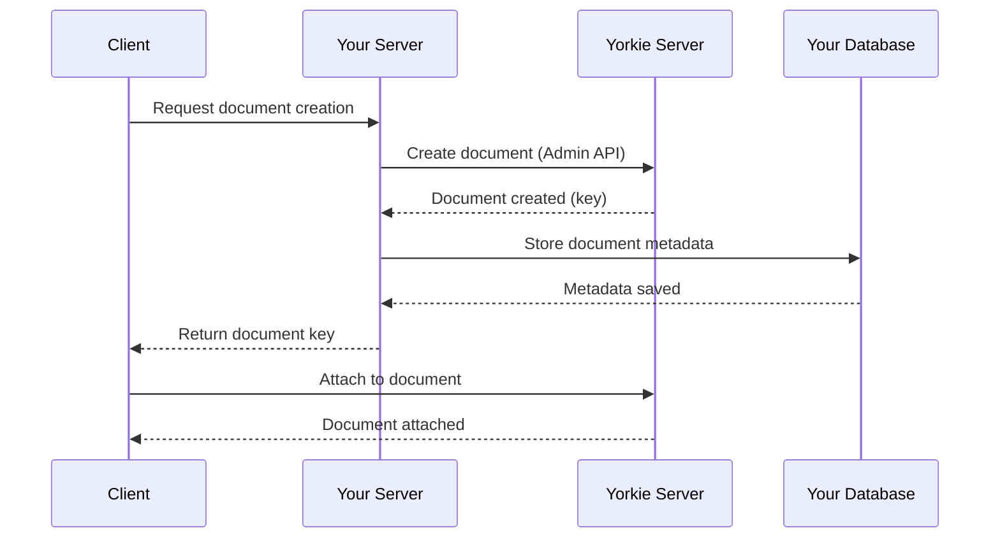
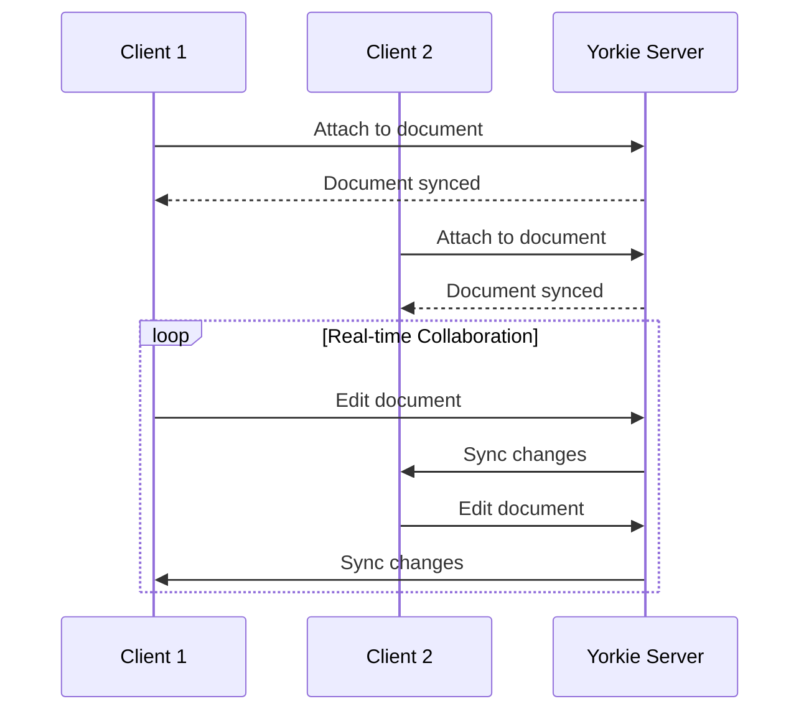
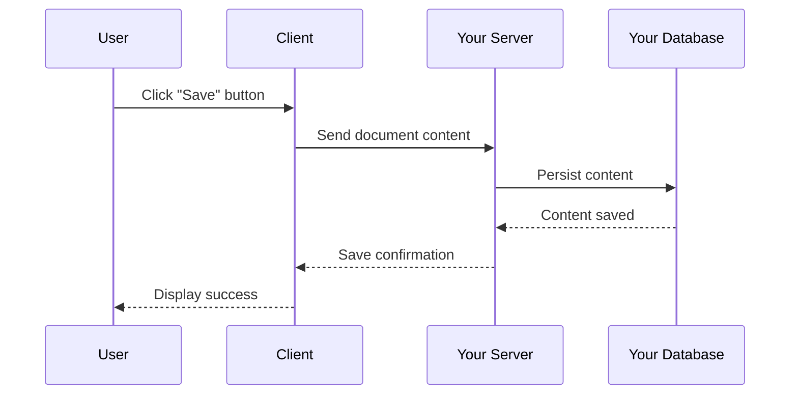
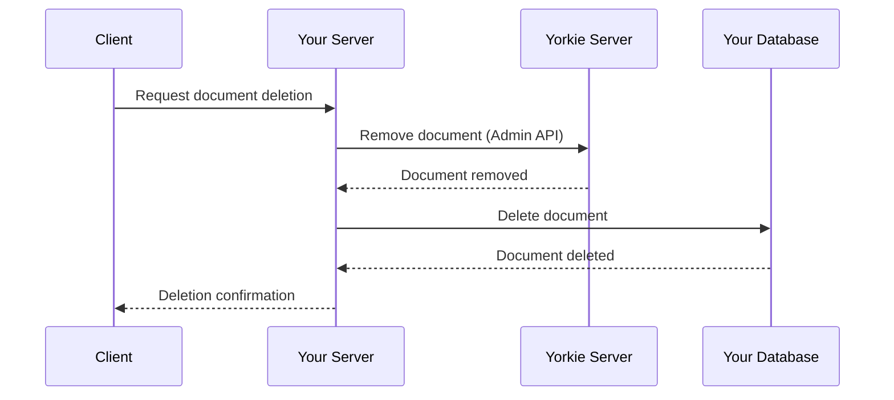
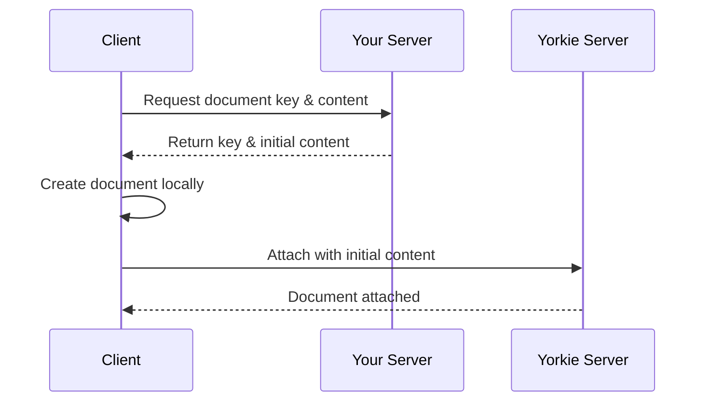
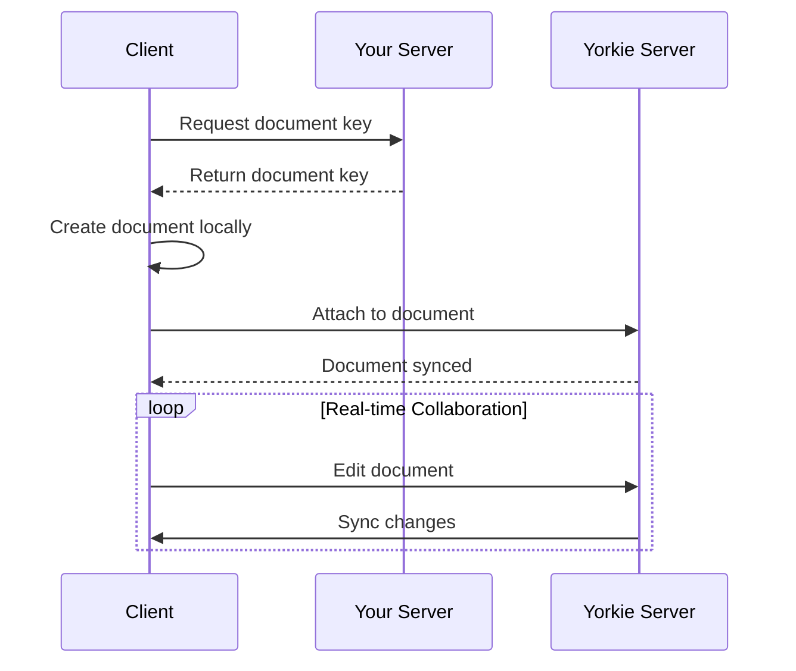
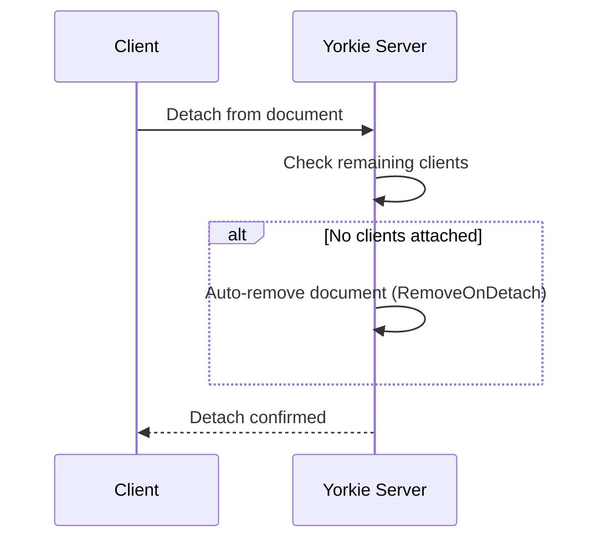
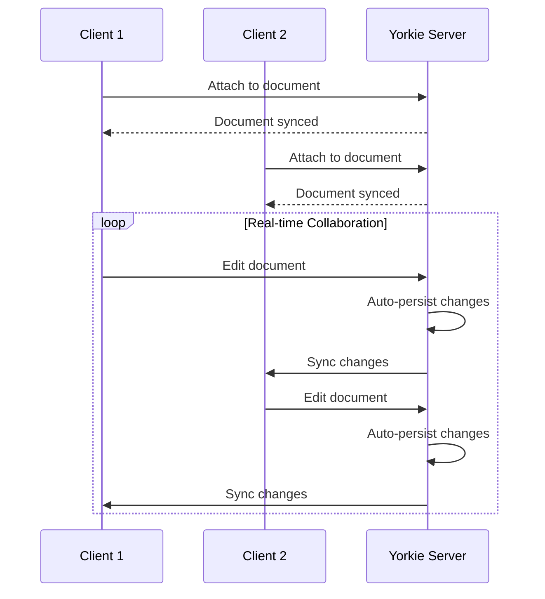
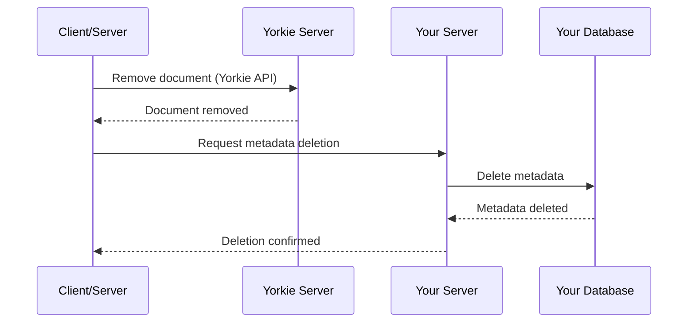

## Architecture Patterns

When integrating Yorkie into your application, you may need to decide how to manage document lifecycle and data persistence, especially when you already have an existing database. This guide presents three recommended architectural patterns based on different Source of Truth (SoT) strategies.

Understanding these patterns will help you design the optimal architecture for your use case, whether you want to maintain real-time collaborative state separately from persistent storage or use Yorkie as the primary data store.

### Before You Begin

If you're new to Yorkie, we recommend:
1. Complete the [Getting Started guide](/docs/getting-started) first
2. Understand basic [Client](/docs/js-sdk#client) and [Document](/docs/js-sdk#document) concepts
3. Familiarize yourself with key terms in the [Glossary](/docs/glossary)
4. Then return here to choose your architecture pattern

### Pattern A: External DB as SoT with Server-Managed Lifecycle

In this pattern, your existing database serves as the Source of Truth, while your server manages the document lifecycle through Yorkie's Admin API. This approach provides centralized control over document creation and deletion, making it suitable for applications that require strict server-side governance.

**Key Characteristics:**
- Server creates and deletes documents via [Admin API](/docs/tools/admin-api#documents-management)
- Clients edit documents directly through Yorkie SDK during collaboration
- Explicit "Save" action persists content to your database
- Server maintains full control over document lifecycle

> **Security Note:** When using Admin API for server-managed lifecycle, secure your API endpoints properly. See [Auth Webhook](/docs/advanced/security#auth-webhook) for authentication setup.

**Document Creation Flow:**



1. Client requests document creation from your server
2. Server creates a new document through [Yorkie Admin API](/docs/tools/admin-api#post-yorkiev1adminservicecreatedocument)
3. Server stores document metadata in your database
4. Server returns document key to client
5. Client [attaches](/docs/js-sdk#attaching-the-document) to the document using the provided key

**Document Editing Flow:**



1. Clients attach to the document via Yorkie SDK
2. Real-time collaborative editing happens through Yorkie
3. Server is not involved during active collaboration
4. All changes are automatically synchronized between clients

**Document Saving Flow:**



1. User clicks "Save" button
2. Client sends document content to your server
3. Server persists the content to your database
4. Server returns save confirmation

**Document Deletion Flow:**



1. Client requests document deletion from your server
2. Server removes document via Yorkie Admin API
3. Server deletes document from your database
4. Server returns deletion confirmation

**When to Use This Pattern:**
- You need strict server-side control over document lifecycle
- Your application requires explicit save/persist actions
- You want to maintain clear separation between real-time and persistent state
- You have existing database infrastructure you want to preserve

---

### Pattern B: External DB as SoT with Client-Only Lifecycle Management

This pattern also uses your external database as the Source of Truth, but delegates document lifecycle management to the client side. This serverless approach simplifies your backend architecture and leverages Yorkie's auto-cleanup features.

**Key Characteristics:**
- Server only provides document keys and initial content
- Clients create and manage documents independently
- Automatic document cleanup via `RemoveOnDetach` project setting (configure via [CLI](/docs/tools/cli#updating-the-project) or Dashboard)
- Explicit "Save" action persists content to your database

**Document Creation Flow:**



1. Client requests document key and initial content from your server
2. Client creates document locally with received key
3. Client attaches document with initial content using the [`initialRoot`](/docs/js-sdk#initializing-root) option:

```typescript
const doc = new yorkie.Document(key); // Key received from server
await client.attach(doc, {
  initialRoot: contents // Initial content from server
});
```

**Document Editing Flow:**



1. Client requests document key from your server
2. Client creates and attaches to document:

```typescript
const doc = new yorkie.Document(key); // Key received from server
await client.attach(doc);
```

3. Real-time collaborative editing happens through Yorkie
4. Server is not involved during active collaboration

**Editing Completion Flow:**



1. Client finishes editing and [detaches](/docs/js-sdk#detaching-the-document) from document
2. With project-level `RemoveOnDetach` option enabled, document is automatically removed when no clients are attached
3. This automatic cleanup reduces server management overhead

**Document Saving Flow:**


1. User clicks "Save" button
2. Client sends document content to your server
3. Server persists the content to your database
4. Server returns save confirmation

**When to Use This Pattern:**
- You want to minimize server-side complexity
- Your application benefits from client-driven architecture
- You need automatic document cleanup
- You still require explicit save actions but want simpler lifecycle management

---

### Pattern C: Yorkie as Source of Truth

In this pattern, Yorkie serves as the primary Source of Truth for your document content. Your database only stores document metadata (e.g., title, owner, created date) while all content lives in Yorkie. This approach provides the most seamless real-time experience.

**Key Characteristics:**
- Yorkie stores and manages all document content
- Your database stores only document metadata
- No explicit "Save" button needed
- All changes are automatically persisted in real-time
- Simplified architecture with single source of truth

> **How It Works:** Yorkie uses CRDT (Conflict-free Replicated Data Types) to ensure automatic conflict resolution, enabling seamless real-time collaboration without manual conflict handling.

**Document Editing Flow:**



1. Client attaches to document via Yorkie SDK
2. All edits are automatically synchronized and persisted
3. No manual save action required
4. Changes are immediately available to all connected clients

**Document Deletion Flow:**



1. Client or server removes document via [Yorkie Admin API](/docs/tools/admin-api#post-yorkiev1adminserviceremovedocument)
2. Server removes document metadata from your database
3. Document content is automatically removed from Yorkie

**When to Use This Pattern:**
- You're building a new application without legacy database constraints
- You want true real-time collaboration without manual saves
- Document content naturally lives in Yorkie (e.g., collaborative editors, whiteboards)
- You prefer simplified architecture with automatic persistence
- Your metadata storage needs are minimal

---

### Choosing the Right Pattern

Consider these factors when selecting an architecture pattern:

| Factor | Pattern A | Pattern B | Pattern C |
|--------|-----------|-----------|-----------|
| Server Control | High | Low | Medium |
| Implementation Complexity | Medium | Low | Low |
| Save Action Required | Yes | Yes | No |
| Best For | Enterprise apps with strict governance | Serverless architectures | Real-time-first applications |
| Database Load | Controlled by saves | Controlled by saves | Minimal (metadata only) |

**Start with Pattern C** if you're building a new collaborative application from scratch. **Choose Pattern A** if you need tight server-side control and have existing database infrastructure. **Choose Pattern B** if you want a simpler client-driven approach while maintaining external persistence.

### See It In Action

Explore real-world examples implementing these patterns:
- [Simultaneous Cursors Example](/examples/simultaneous-cursors) - Pattern C with real-time presence
- [ToDo MVC Example](/examples/react-todomvc) - Real-time collaboration
- [Quill Editor Example](/examples/nextjs-quill) - Collaborative text editing
- [View All Examples](/examples)

### Related Documentation

For more information about Yorkie's API and features:
- [JS SDK Documentation](/docs/js-sdk) - Client and Document API reference
- [Admin API](/docs/tools/admin-api) - Admin API for server-side management
- [Security Configuration](/docs/advanced/security) - Auth Webhook and access control
- [CLI](/docs/tools/cli) - Command-line tools for project management
- [Glossary](/docs/glossary) - Key terminology and concepts
