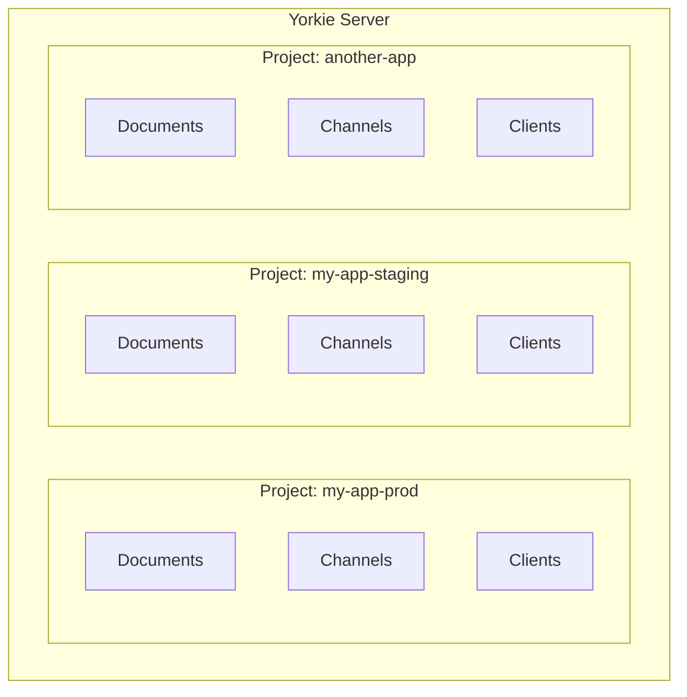

## Projects

A **Project** in Yorkie is a logical grouping that isolates documents, channels, and clients. Projects enable multi-tenancy, allowing you to run multiple independent applications or environments within a single Yorkie installation.

### Overview

Every Yorkie installation starts with a `default` project that is created automatically. When a [Client](/docs/sdks/js-sdk#client) connects without specifying an API key, it is placed in the default project. For production applications, you should create dedicated projects to isolate data and configure settings independently.



### Project Isolation

Each project provides complete isolation:

- **Documents** in one project are invisible to clients in another project. A document key like `doc-1` can exist independently in multiple projects.
- **Channels** are scoped to their project. Broadcast messages and presence updates only reach clients within the same project.
- **Clients** belong to exactly one project, determined by the API key they use to connect.
- **Configuration** (auth webhooks, event webhooks, resource limits, housekeeping thresholds) is set per project.

### API Keys

Each project has two keys:

| Key | Purpose | Usage |
|-----|---------|-------|
| **Public Key** | Identifies the project for client connections | Used as `apiKey` when creating a [Client](/docs/sdks/js-sdk#client) |
| **Secret Key** | Authenticates server-side applications | Used in the `authorization` header for [Admin API](/docs/tools/admin-api) requests |

```javascript
// Connect a client to a specific project using its public key
const client = new yorkie.Client({
  rpcAddr: '{{API_ADDR}}',
  apiKey: 'your-project-public-key',
});
```

> Keep your **Secret Key** confidential. It grants full access to manage documents within the project via the [Admin API](/docs/tools/admin-api). Never expose it in client-side code.

### Managing Projects

Projects are managed through the [CLI](/docs/tools/cli#project) or the [Dashboard]({{DASHBOARD_PATH}}).

#### Creating a Project

```bash
$ yorkie project create my-app-prod
```

This returns the project details including both keys:

```json
{
  "name": "my-app-prod",
  "public_key": "...",
  "secret_key": "...",
  "created_at": "..."
}
```

#### Listing Projects

```bash
$ yorkie project ls
```

#### Updating a Project

Configure project settings such as auth webhooks, event webhooks, and resource limits:

```bash
# Set an auth webhook URL
$ yorkie project update my-app-prod --auth-webhook-url https://my-server.com/auth

# Configure event webhooks
$ yorkie project update my-app-prod \
  --event-webhook-url https://my-server.com/events \
  --event-webhook-events-add DocumentRootChanged

# Set resource limits
$ yorkie project update my-app-prod \
  --max-attachments-per-document 50 \
  --max-subscribers-per-document 100

# Configure housekeeping
$ yorkie project update my-app-prod \
  --client-deactivate-threshold 24h
```

For the full set of update options, see [Updating the Project](/docs/tools/cli#updating-the-project).

### Per-Project Configuration

Each project can be independently configured with the following settings:

| Setting | Description | Reference |
|---------|-------------|-----------|
| **Auth Webhook** | External authentication endpoint for validating client requests | [Security: Auth Webhook](/docs/advanced/security#auth-webhook) |
| **Event Webhook** | Notification endpoint for document events | [Event Webhook](/docs/advanced/event-webhook) |
| **Allowed Origins** | CORS restrictions for client connections | [Security: Allowed Origins](/docs/advanced/security#allowed-origins) |
| **Max Attachments** | Maximum clients that can attach to a single document | [Document Limits](/docs/sdks/js-sdk#document-limits) |
| **Max Subscribers** | Maximum clients that can subscribe to a single document | [Document Limits](/docs/sdks/js-sdk#document-limits) |
| **Client Deactivate Threshold** | Time after which inactive clients are automatically deactivated by [Housekeeping](/docs/internals/housekeeping) | [CLI](/docs/tools/cli#updating-the-project) |

### Common Patterns

#### Separate Environments

Create distinct projects for development, staging, and production:

```bash
$ yorkie project create my-app-dev
$ yorkie project create my-app-staging
$ yorkie project create my-app-prod
```

Use environment variables in your application to select the appropriate API key:

```javascript
const client = new yorkie.Client({
  rpcAddr: process.env.YORKIE_RPC_ADDR,
  apiKey: process.env.YORKIE_API_KEY,
});
```

#### Multiple Applications

If you host multiple collaborative applications on a single Yorkie server, create a project for each:

```bash
$ yorkie project create docs-app
$ yorkie project create whiteboard-app
$ yorkie project create chat-app
```

Each application's documents, channels, and client data remain fully isolated.

### Further Reading

- [CLI: Project Management](/docs/tools/cli#project) -- Full CLI reference for project commands
- [Admin API](/docs/tools/admin-api) -- Server-side document management using the project's secret key
- [Security](/docs/advanced/security) -- Configuring auth webhooks and allowed origins
- [Resources](/docs/advanced/resources) -- Configuring project-level resource limits
- [Glossary](/docs/glossary) -- Definitions of all key terms
