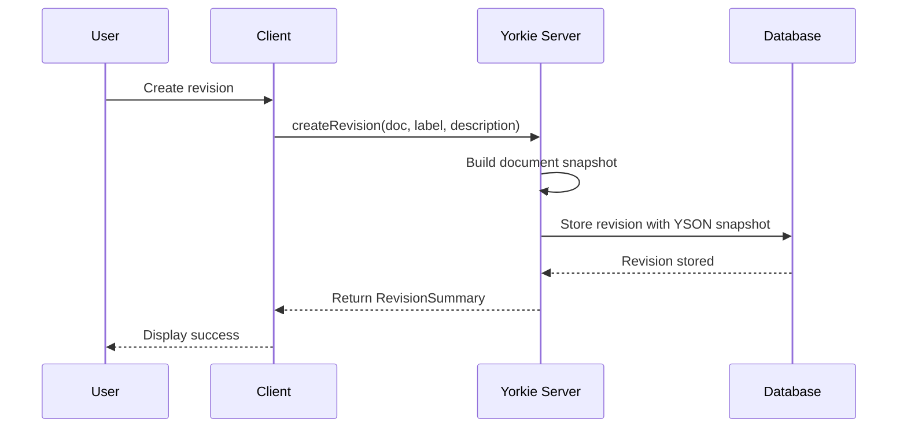
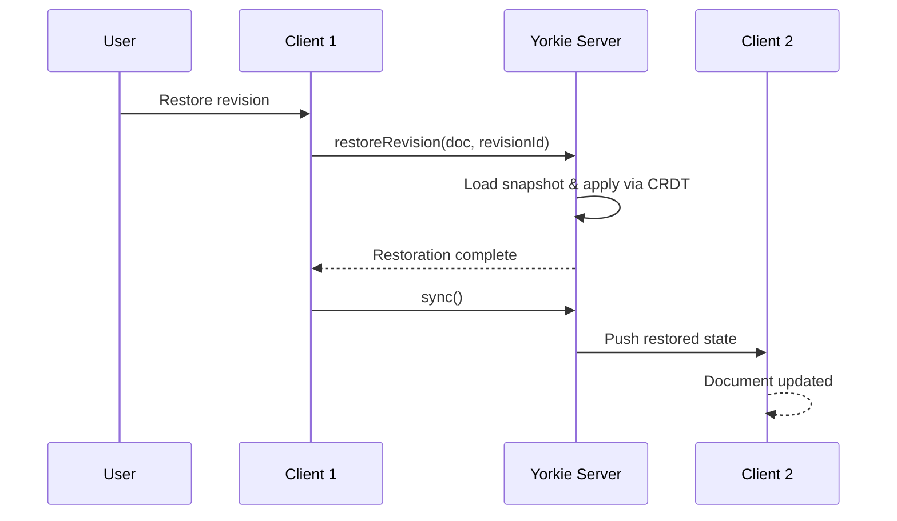

## Revisions

Revisions provide version control for Yorkie documents, allowing you to save snapshots at specific points in time, browse history, and restore previous states. This guide explains how to integrate revision features into your application.

### Overview

Revisions are immutable snapshots of a document's state stored on the server. Each revision contains:

- **Label**: A user-friendly identifier (e.g., "v1.0", "Draft", "Final")
- **Description**: Optional detailed explanation of what changed
- **Snapshot**: The complete document state in [YSON](/docs/internals/yson) format
- **Timestamp**: When the revision was created
- **Server Sequence**: The document's server sequence number at creation time

### Use Cases

- **Version History**: Allow users to browse and restore previous document versions
- **Milestone Tracking**: Save important states before major changes
- **Audit Trail**: Maintain a record of document evolution over time
- **Collaboration Review**: Preview changes before accepting them
- **Rollback**: Recover from unwanted changes or errors

### Before You Begin

This guide assumes familiarity with:
1. [Client](/docs/sdks/js-sdk#client) and [Document](/docs/sdks/js-sdk#document) basics
2. [YSON format](/docs/internals/yson) for understanding snapshots

### How Revisions Work



When you create a revision:
1. The server builds the current document state
2. The state is serialized to YSON format (data only, no CRDT metadata)
3. The revision is stored with metadata in the database
4. A `RevisionSummary` is returned to the client

### API Reference

For detailed API documentation, see [JS SDK - Document Revisions](/docs/sdks/js-sdk#document-revisions).

| Method | Description |
|--------|-------------|
| `client.createRevision(doc, label, description?)` | Create a new revision |
| `client.listRevisions(doc, options?)` | List revisions with pagination |
| `client.getRevision(doc, revisionId)` | Get revision details with snapshot |
| `client.restoreRevision(doc, revisionId)` | Restore document to a revision |

### Building a Revision UI

This section shows how to build a revision management interface, using patterns from [CodePair](https://github.com/yorkie-team/codepair) as a reference.

#### React Hook (Recommended)

`@yorkie-js/react` provides a built-in `useRevisions` hook that wraps the client's revision API and automatically binds the current client and document. Use it inside a `DocumentProvider`:

```tsx
import { useState, useEffect } from 'react';
import { useRevisions } from '@yorkie-js/react';
import type { RevisionSummary } from '@yorkie-js/react';

function RevisionPanel() {
  const { createRevision, listRevisions, getRevision, restoreRevision } =
    useRevisions();
  const [revisions, setRevisions] = useState<RevisionSummary[]>([]);

  useEffect(() => {
    listRevisions({ pageSize: 20, isForward: false }).then(setRevisions);
  }, [listRevisions]);

  const handleCreate = async () => {
    const label = `v${new Date().toISOString().split('T')[0]}`;
    await createRevision(label, 'Manual checkpoint');
    setRevisions(await listRevisions({ pageSize: 20 }));
  };

  const handlePreview = async (revisionId: string) => {
    const revision = await getRevision(revisionId);
    // Display revision.snapshot in a preview dialog
  };

  const handleRestore = async (revisionId: string) => {
    if (confirm('Restore to this revision? Current state will be replaced.')) {
      await restoreRevision(revisionId);
      setRevisions(await listRevisions({ pageSize: 20 }));
    }
  };

  return (
    <div>
      <button onClick={handleCreate}>Save Revision</button>
      <ul>
        {revisions.map((rev) => (
          <li key={rev.id}>
            <span>{rev.label}</span>
            <span>{new Date(rev.createdAt).toLocaleString()}</span>
            <button onClick={() => handlePreview(rev.id)}>Preview</button>
            <button onClick={() => handleRestore(rev.id)}>Restore</button>
          </li>
        ))}
      </ul>
    </div>
  );
}
```

The hook returns four methods:

| Method | Description |
|--------|-------------|
| `createRevision(label, description?)` | Create a named revision snapshot |
| `listRevisions(options?)` | List revisions with pagination (`pageSize`, `offset`, `isForward`) |
| `getRevision(revisionID)` | Get a revision with its full snapshot |
| `restoreRevision(revisionID)` | Restore the document to a previous revision |

For the full hook API reference, see [React SDK - useRevisions](/docs/sdks/react#userevisions).

For a complete working example, see the [react-revision](https://github.com/yorkie-team/yorkie-js-sdk/tree/main/examples/react-revision) example.

#### Manual Approach

If you need custom loading/error state management or aren't using `DocumentProvider`, you can build a custom hook using the client API directly:

```typescript
import { useState, useCallback, useEffect } from 'react';
import { Client, Document, RevisionSummary } from '@yorkie-js/sdk';

export function useCustomRevisions(client: Client | null, doc: Document<any, any> | null) {
  const [revisions, setRevisions] = useState<RevisionSummary[]>([]);
  const [isLoading, setIsLoading] = useState(false);

  const fetchRevisions = useCallback(async () => {
    if (!client || !doc) return;
    setIsLoading(true);
    try {
      const revs = await client.listRevisions(doc, { pageSize: 50, isForward: false });
      setRevisions(revs);
    } finally {
      setIsLoading(false);
    }
  }, [client, doc]);

  const createRevision = useCallback(async (label: string, description?: string) => {
    if (!client || !doc) throw new Error('Client or document not available');
    setIsLoading(true);
    try {
      const revision = await client.createRevision(doc, label, description);
      await fetchRevisions();
      return revision;
    } finally {
      setIsLoading(false);
    }
  }, [client, doc, fetchRevisions]);

  useEffect(() => {
    if (client && doc) fetchRevisions();
  }, [client, doc, fetchRevisions]);

  return { revisions, isLoading, createRevision, fetchRevisions };
}
```

#### Previewing Snapshots

Use the `YSON` parser to convert snapshots into readable data:

```typescript
import { YSON } from '@yorkie-js/sdk';

async function previewRevision(revisionId: string) {
  const revision = await client.getRevision(doc, revisionId);

  if (revision.snapshot) {
    // Parse YSON to get document data
    const data = YSON.parse<YourDocType>(revision.snapshot);

    // For Text fields, convert to plain string
    if (data.content) {
      const plainText = YSON.textToString(data.content);
      console.log('Document content:', plainText);
    }
  }
}
```

### Restoration Flow

When restoring a revision, the server:

1. Loads the revision's YSON snapshot
2. Creates a new document state from the snapshot
3. Applies the change through the CRDT merge process
4. Syncs the restored state to all connected clients



<Alert status="warning">
Restoring replaces the entire document state. Consider creating a new revision before restoring to preserve the current state as a backup.
</Alert>

### Auto-Revisions

Yorkie can automatically create revisions during snapshot creation. This is controlled by the `auto-revision-enabled` project setting.

| Setting | Default | Description |
|---------|---------|-------------|
| `auto-revision-enabled` | `true` | Automatically create revisions during snapshots |

When enabled:
- Revisions are created automatically during garbage collection snapshots
- Labels follow the format: `snapshot-{serverSeq}`
- Descriptions: `Auto created revision of snapshot #{serverSeq}`

Configure via the Dashboard or [Admin API](/docs/tools/admin-api#post-yorkiev1adminserviceupdateproject). See [Resources](/docs/advanced/resources#autorevisionenabled) for details.

### Best Practices

#### When to Create Revisions

- **Before major edits**: Save state before significant changes
- **At milestones**: Mark completion of features or sections
- **Periodically**: For long editing sessions, create time-based checkpoints
- **Before restore**: Always save current state before restoring an old revision

#### Labeling Conventions

Use consistent, descriptive labels:

| Pattern | Example | Use Case |
|---------|---------|----------|
| Version numbers | `v1.0`, `v2.1` | Release milestones |
| Date-based | `2024-01-15`, `backup-2024-01-15` | Time-based checkpoints |
| Feature names | `auth-complete`, `refactor-done` | Feature milestones |
| Descriptive | `before-review`, `final-draft` | Workflow stages |

#### Storage Considerations

- Revisions store full document snapshots, not deltas
- Each revision consumes storage proportional to document size
- Use auto-revisions judiciously for large documents
- Consider periodic cleanup of old revisions if storage is a concern

### Permissions

Revision operations require appropriate document permissions:

| Operation | Required Permission |
|-----------|-------------------|
| Create | Write access |
| List | Read access |
| Get | Read access |
| Restore | Write access |

### Related Documentation

- [JS SDK - Document Revisions](/docs/sdks/js-sdk#document-revisions) - Complete API reference
- [React SDK - useRevisions](/docs/sdks/react#userevisions) - React hook for revision management
- [YSON](/docs/internals/yson) - Understanding snapshot format
- [Resources](/docs/advanced/resources) - Project configuration including auto-revisions
- [CodePair](https://github.com/yorkie-team/codepair) - Reference implementation
