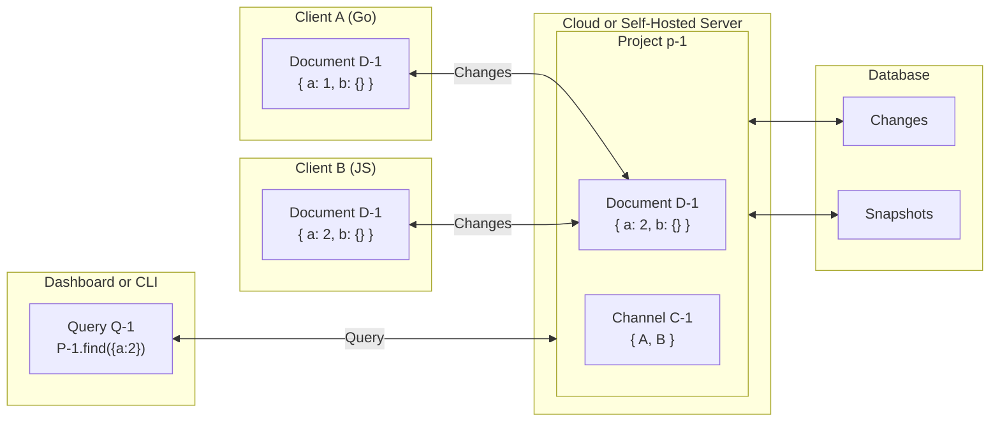

## About Yorkie

Yorkie is an open-source document store for building real-time collaborative applications. Think Google Docs, Figma, or any application where multiple users work together simultaneously - Yorkie provides the infrastructure to make that happen.

### What is Yorkie?

Yorkie is a comprehensive collaboration platform that handles the complex challenges of building real-time collaborative applications. It provides:

- [JSON-like Document](/docs/sdks/js-sdk#document) based on [Conflict-free Replicated Data Types (CRDTs)](/docs/glossary) for automatic conflict resolution
- [Presence](/docs/sdks/js-sdk#presence) tracking to show who's online and what they're doing
- [Channel](/docs/sdks/js-sdk#channel) for lightweight, real-time communication without data persistence
- Offline support with automatic synchronization when network is restored

### Why Yorkie?

Unlike other CRDT libraries like AutoMerge and Yjs that only provide data structures, Yorkie delivers a complete full-stack solution:

- Client SDKs for [JavaScript](/docs/sdks/js-sdk), [React](/docs/getting-started/with-react), [Android](/docs/sdks/android-sdk), and [iOS](/docs/sdks/ios-sdk)
- Managed Cloud Service or [Self-Hosted Server](/docs/self-hosted-server) options
- Built-in Infrastructure for data persistence, synchronization, and scaling
- [Admin APIs](/docs/tools/admin-api) for server-side document management
- [Dashboard](https://yorkie.dev/dashboard) and [CLI](/docs/tools/cli) for project management and monitoring

This means you can focus on building your application's features instead of managing collaboration infrastructure.

### Core Components

Yorkie consists of four main components that work together to enable real-time collaboration:

- [Client](/docs/sdks/js-sdk#client): The entry point for your application. Clients connect to the server, manage documents and channels, and handle synchronization automatically.
- [Document](/docs/sdks/js-sdk#document): Persistent, collaborative data structures based on CRDTs. Documents are stored in the database, support offline editing, and automatically resolve conflicts when users edit simultaneously.
- [Channel](/docs/sdks/js-sdk#channel): A lightweight, memory-only communication layer for ephemeral data. Ideal for presence tracking (who's online, cursor positions) and real-time message broadcasting.
- [Server](/docs/self-hosted-server): The central hub that receives changes from clients, persists them to the database, and broadcasts updates to subscribed clients. Available as a managed cloud service or self-hosted.

Additionally, **[Projects](/docs/tools/cli#project)** allow you to organize multiple independent applications within a single Yorkie installation, each with its own documents, channels, and clients. Learn more about key concepts in the [Glossary](/docs/glossary).

Yorkie offers flexibility in how you deploy:
- **Cloud**: Get started instantly with our managed service - no infrastructure setup required
- **Self-Hosted**: Full control over your data and infrastructure for security and compliance needs

### How it works

Here's a high-level overview of Yorkie's architecture:

**The Collaboration Flow:**

1. Multiple Replicas: Each client maintains its own replica of a document, representing your application's data model
2. Offline Editing: Clients can edit documents independently, even without network connectivity
3. Automatic Sync: When connected, Yorkie determines which changes need synchronization and updates all clients
4. Conflict Resolution: If multiple users edit simultaneously, Yorkie's CRDTs automatically resolve conflicts, ensuring all replicas converge to the same state

This architecture enables seamless real-time collaboration while supporting offline work, making it ideal for modern collaborative applications.

### Use Cases

Yorkie is perfect for building various types of collaborative applications:

- **Collaborative Editors**: Build the next Google Docs or Notion with [rich text editing examples](/examples/quill)
- **Real-time Whiteboards**: Create Figma-like experiences with [drawing applications](/examples/tldraw)
- **Project Management Tools**: Develop Trello-style boards with [kanban examples](/examples/kanban)
- **Code Collaboration**: Enable pair programming with [CodeMirror integration](/examples/codemirror)
- **Presence & Cursors**: Show who's online with [simultaneous cursors](/examples/simultaneous-cursors)

Explore more [examples](/examples) to see what you can build with Yorkie.

### Next Steps

**Get Started Quickly:**
- Follow the [Getting Started guide](/docs/getting-started) for step-by-step integration
- Choose your platform: [JavaScript](/docs/sdks/js-sdk), [React](/docs/getting-started/with-react), [Android](/docs/sdks/android-sdk), or [iOS](/docs/sdks/ios-sdk)
- Try our [live examples](/examples) to see Yorkie in action

**Dive Deeper:**
- Understand [Architecture Patterns](/docs/advanced/architecture-patterns) to design your collaboration system
- Learn about [security best practices](/docs/advanced/security) for production deployments
- Explore [CLI commands](/docs/tools/cli) for managing your projects
- Check the [Glossary](/docs/glossary) for terminology reference
