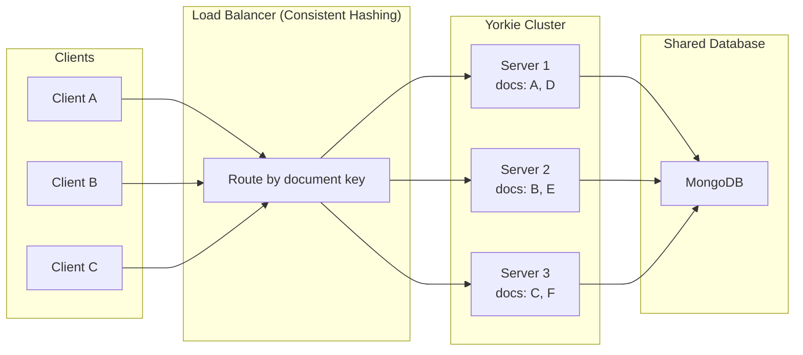

## Cluster Mode

For production deployments that require high availability, scalability, and reliability, Yorkie provides a **sharded cluster mode**. This page explains how clustering works and the key architectural concepts behind it.

### Overview

In a single-server setup, all documents and clients are handled by one Yorkie instance. As your workload grows, a cluster distributes the load across multiple Yorkie servers, each responsible for a subset of documents.

Yorkie's cluster mode uses **document-based sharding** with consistent hashing to route requests for the same document to the same server. This eliminates the need for servers to share document state with each other.



### Sharding Strategy

The cluster mode uses **consistent hashing** to map documents to servers:

- Each server is assigned positions on a virtual hash ring.
- When a request arrives, the document key is hashed and routed to the nearest server on the ring (clockwise).
- When a server is added or removed, only a minimal number of documents are remapped (this property is called **minimal disruption**).

Yorkie supports two consistent hashing algorithms:

| Algorithm | Description | Best For |
|-----------|-------------|----------|
| **Ring Hash** | Classic consistent hashing with virtual nodes on a ring | General purpose, simpler configuration |
| **Maglev** | Google's load balancer algorithm using preference lists and lookup tables | More efficient rehashing, better load balancing |

### Architecture Components

A Yorkie cluster consists of three components:

| Component | Role | Analogous To |
|-----------|------|-------------|
| **Router (Proxy)** | Receives client requests and routes them to the correct server based on consistent hashing | MongoDB `mongos` |
| **Service Registry** | Stores metadata and locations of all Yorkie servers | MongoDB config server |
| **Yorkie Servers** | Individual server instances that process document operations | MongoDB `mongod` shards |

### Kubernetes and Istio Implementation

The recommended way to deploy a Yorkie cluster is with [Kubernetes](https://kubernetes.io/) and [Istio](https://istio.io/):

| Cluster Component | K8s/Istio Implementation |
|-------------------|-------------------------|
| Router (Proxy) | Istio Ingress Gateway (Envoy) |
| Service Registry | Istio Pilot (istiod) + etcd |
| Yorkie Servers | Kubernetes Pods/Deployments |

Istio's `DestinationRule` resource configures consistent hash-based routing:

```yaml
apiVersion: networking.istio.io/v1alpha3
kind: DestinationRule
metadata:
  name: yorkie
spec:
  host: yorkie
  trafficPolicy:
    portLevelSettings:
      - port:
          number: 8080
        loadBalancer:
          consistentHash:
            ringHash:
              minimumRingSize: 1024
            httpHeaderName: "x-shard-key"
```

The `x-shard-key` header (containing the project and document key) determines which server handles the request.

For step-by-step deployment guides, see [Self-Hosted Server on Minikube](/docs/self-hosted-server/minikube) and [Self-Hosted Server on AWS EKS](/docs/self-hosted-server/aws-eks).

### Membership Management

In a cluster, Yorkie uses a **leader-member structure** for coordinating cluster-wide tasks:

- **Leader**: A single node elected to handle cluster-wide operations like [Housekeeping](/docs/glossary) (client deactivation and document compaction).
- **Members**: All other nodes that process client requests normally.

Leader election is enforced at the database level:

- A database-level unique index guarantees at most one leader at a time.
- The leader periodically renews its **lease** (default: every 5 seconds, with a 15-second lease duration).
- If the leader fails to renew, another member acquires leadership.
- Short periods with no leader are tolerated -- only housekeeping tasks are delayed, and user-facing requests remain unaffected.

All nodes send periodic **heartbeats** to the database to indicate they are alive. The cluster uses a **liveness window** (default: 10 seconds) to detect inactive nodes.

For the full design, see the [Membership Management design document](https://github.com/yorkie-team/yorkie/blob/main/design/membership.md).

### MongoDB Sharding

For large-scale deployments, Yorkie supports **sharded MongoDB clusters** to distribute data and query loads:

| Collection Scope | Collections | Shard Key | Method |
|-----------------|-------------|-----------|--------|
| **Cluster-wide** | `users`, `projects` | Not sharded (small data volume) | N/A |
| **Project-wide** | `clients`, `documents`, `schemas` | `project_id` (+ `_id` for clients) | Ranged / Hashed |
| **Document-wide** | `changes`, `snapshots`, `versionvectors`, `revisions` | `doc_id` | Hashed |

Hashed sharding on `doc_id` for document-wide collections provides:
- **Even data distribution**: Prevents hotspots from sequential ObjectID generation.
- **Improved write performance**: Writes are distributed across all shards.
- **Better scalability**: New shards immediately participate in handling traffic.

For the full sharding strategy, see the [MongoDB Sharding design document](https://github.com/yorkie-team/yorkie/blob/main/design/mongodb-sharding.md).

### Watch Stream in Cluster Mode

The [Watch Stream](/docs/internals/synchronization#the-watch-stream) uses long-lived gRPC connections. When the cluster topology changes (servers added/removed), existing connections may not be automatically rerouted. Yorkie mitigates this with:

- **gRPC Max Connection Age**: Periodically closes long-lived connections, forcing reconnection to the correct server.
- **Envoy Stream Idle Timeout**: Closes idle connections that may be "split-brained" (connected to the wrong server after a topology change).

These mechanisms ensure that all clients eventually reconnect to the correct server after topology changes.

### Fine-Grained Document Locking

To maximize concurrency on popular documents, Yorkie uses **fine-grained locking** instead of a single document lock:

| Lock | Purpose |
|------|---------|
| **`doc`** (RW Lock) | Coordinates between normal operations (read lock) and compaction (write lock) |
| **`doc.pull`** | Ensures consistency when pulling changes from the server |
| **`doc.attachment`** | Protects attach/detach operations and attachment limit checks |
| **`doc.push`** | Ensures consistency when pushing changes to the server |

Locks are always acquired in order (`doc` → `doc.pull` → `doc.attachment` → `doc.push`) to prevent deadlocks. This allows concurrent reads during compaction and independent push/pull operations.

For the full design, see the [Fine-Grained Document Locking design document](https://github.com/yorkie-team/yorkie/blob/main/design/fine-grained-document-locking.md).

### Production Deployment Considerations

When deploying a Yorkie cluster in production:

- **Database redundancy**: Use a MongoDB replica set (recommended: 3 members per shard) for data safety.
- **Multiple routers**: Deploy at least 2 Istio Ingress Gateways for high availability.
- **Monitoring**: Track leader election failures, heartbeat timestamps, lock wait times, and broadcast success rates.
- **Housekeeping tuning**: Adjust the `Interval`, `CandidatesLimit`, and `CompactionMinChanges` settings based on your workload. See the [Housekeeping design document](https://github.com/yorkie-team/yorkie/blob/main/design/housekeeping.md) for configuration examples.

### Further Reading

- [Self-Hosted Server](/docs/self-hosted-server) -- How to run your own Yorkie server
- [Self-Hosted Server on Minikube](/docs/self-hosted-server/minikube) -- Local Kubernetes deployment guide
- [Self-Hosted Server on AWS EKS](/docs/self-hosted-server/aws-eks) -- AWS deployment guide
- [Cluster Addons](/docs/self-hosted-server/cluster-addons) -- Additional components for cluster deployments
- [Sharded Cluster Mode design document](https://github.com/yorkie-team/yorkie/blob/main/design/sharded-cluster-mode.md) -- Full consistent hashing design
- [Membership Management design document](https://github.com/yorkie-team/yorkie/blob/main/design/membership.md) -- Leader election and node lifecycle
- [MongoDB Sharding design document](https://github.com/yorkie-team/yorkie/blob/main/design/mongodb-sharding.md) -- Database sharding strategy
- [Fine-Grained Document Locking design document](https://github.com/yorkie-team/yorkie/blob/main/design/fine-grained-document-locking.md) -- Concurrency optimization
- [Glossary](/docs/glossary) -- Definitions of all key terms
