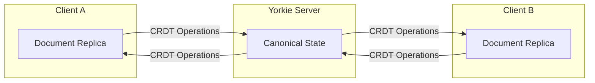
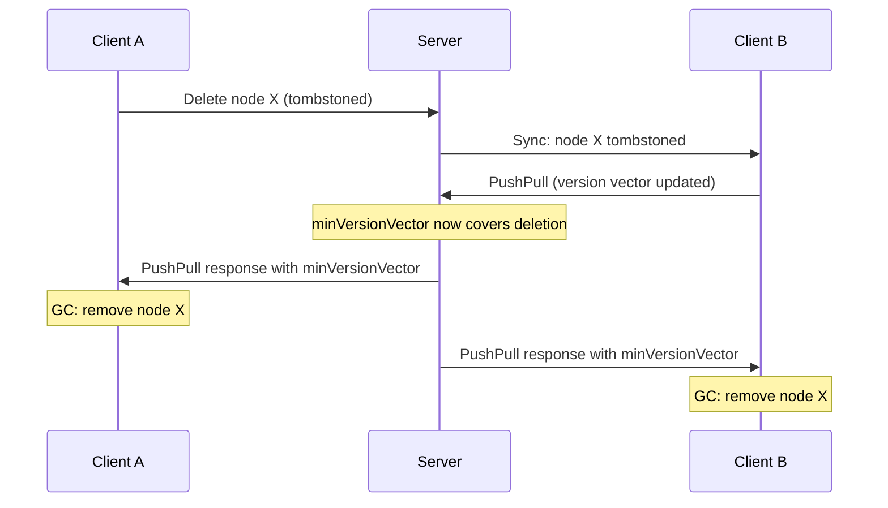

## CRDT Concepts

Yorkie uses Conflict-free Replicated Data Types (CRDTs) to enable real-time collaboration without coordination between clients. This page explains the key CRDT concepts that underpin Yorkie's data model.

### What Are CRDTs?

CRDTs are data structures that can be replicated across multiple clients, where each client can update its replica independently, and all replicas are guaranteed to converge to the same state. This means multiple users can edit a [Document](/docs/js-sdk#document) simultaneously without conflicts, even while offline.

Unlike traditional conflict resolution approaches (such as Operational Transformation used by Google Docs), CRDTs provide mathematically guaranteed convergence. Every operation that can be applied to a CRDT is designed so that, regardless of the order operations are received, the final state is always the same.

### How Yorkie Uses CRDTs

Yorkie's [Document](/docs/js-sdk#document) is built on a CRDT-based data structure. When you call `document.update()`, the changes you make to the [Root](/docs/js-sdk#initializing-root) are internally represented as CRDT operations. These operations are then synchronized with the [Server](/docs/self-hosted-server) and delivered to other clients via the [PushPullChanges](/docs/internals/synchronization#pushpullchanges) mechanism.

### Data Structure Hierarchy

Yorkie organizes its internal data structures into three layers, each building on the one below:

#### JSON-like Layer

These are the data types you interact with directly when editing documents through `document.update()`:

| Type | Description | Underlying CRDT |
|------|-------------|-----------------|
| **Primitive** | Basic values: `string`, `number`, `boolean`, `null` | N/A (immutable values) |
| **Object** | Key-value pairs, like a JavaScript object or hash table | [RHT](#replicated-hash-table-rht) (Replicated Hash Table) |
| **Array** | Ordered list of values | [RGATreeList](#replicated-growable-array-rga) |
| **[Text](/docs/js-sdk#custom-crdt-types)** | Rich text with style attributes for editors like [Quill](/examples/quill) and [CodeMirror](/examples/codemirror) | RGATreeSplit |
| **[Counter](/docs/js-sdk#custom-crdt-types)** | Concurrent counter for increment/decrement operations | CRDT Counter |
| **[Tree](/docs/js-sdk#custom-crdt-types)** | Tree structure for block-based editors like ProseMirror | [CRDTTree](#the-tree-crdt) |

#### CRDT Layer

These data structures resolve conflicts in concurrent editing. They are used internally by the JSON-like layer:

| Type | Description |
|------|-------------|
| **RHT** (Replicated Hash Table) | A hash table that resolves concurrent key updates using [Lamport timestamps](#logical-clocks-and-timetickets). See [RHT section](#replicated-hash-table-rht). |
| **ElementRHT** | An RHT variant that stores CRDT elements as values. |
| **RGATreeList** | An RGA (Replicated Growable Array) with an index tree for fast positional access. See [RGA section](#replicated-growable-array-rga). |
| **RGATreeSplit** | An RGA variant that represents characters as blocks rather than individual characters, optimizing text editing. |
| **CRDTTree** | A tree CRDT that resolves conflicts in concurrent tree editing. See [Tree section](#the-tree-crdt). |

#### Common Layer

General-purpose data structures used by the CRDT layer:

| Type | Description |
|------|-------------|
| **[SplayTree](https://en.wikipedia.org/wiki/Splay_tree)** | A self-adjusting binary search tree. Moves frequently accessed nodes to the root, which is effective for text editing where users access nearby positions. Used as an index tree to provide fast positional access. |
| **[LLRBTree](https://en.wikipedia.org/wiki/Left-leaning_red%E2%80%93black_tree)** | A left-leaning red-black tree. Simpler than a standard red-black tree, used for ordered key lookups. |
| **IndexTree** | A tree structure representing the document model of text-based editors. |

For the full dependency graph and technical details, see the [Data Structures design document](https://github.com/yorkie-team/yorkie/blob/main/design/data-structure.md).

### Logical Clocks and TimeTickets

In a distributed system, physical clocks on different machines can disagree about the current time. Yorkie uses **logical clocks** to establish a consistent ordering of events across all clients.

#### Lamport Timestamps

A [Lamport timestamp](https://en.wikipedia.org/wiki/Lamport_timestamp) is a counter that increments with every operation. When a client receives changes from another client, it updates its own counter to at least match the received timestamp. This ensures that all clients can agree on the order of operations.

#### TimeTickets

In Yorkie, every CRDT node is identified by a **TimeTicket** -- a unique ID composed of:

| Field | Purpose |
|-------|---------|
| **Lamport** | The Lamport timestamp at the time of creation |
| **ActorID** | The unique ID of the client that created the node |
| **Delimiter** | Distinguishes multiple nodes created in the same operation |

TimeTickets provide global uniqueness: no two nodes across any clients will ever share the same TimeTicket. They also define a total ordering, which is used for conflict resolution (e.g., last-writer-wins uses the Lamport value to determine which write is "later").

#### Version Vectors

While Lamport timestamps provide ordering, they cannot fully capture **causal relationships** between events. For [Garbage Collection](/docs/internals/crdt-concepts#garbage-collection), Yorkie needs to know whether all clients have observed a particular deletion -- not just that the deletion has a certain timestamp.

To solve this, Yorkie uses a **Lamport Synced Version Vector** -- a hybrid of Lamport timestamps and [Version Vectors](https://en.wikipedia.org/wiki/Version_vector):

- Each client maintains a vector with one entry per participant, tracking the latest Lamport value it has seen from each client.
- During synchronization, vectors are merged by taking the maximum value for each entry, with the additional Lamport merge rule applied to keep the vector synchronized with the Lamport clock.
- This ensures both the causal guarantees of Version Vectors and compatibility with Yorkie's TimeTicket-based node IDs.

The server uses the **minimum Version Vector** (`minVersionVector`) across all active clients to determine when tombstoned nodes can be safely garbage collected.

For the full technical design, see the [Version Vector design document](https://github.com/yorkie-team/yorkie/blob/main/design/version-vector.md).

### CRDT Elements and Nodes

Yorkie organizes its data model into **CRDT Elements** and **CRDT Nodes**:

- **CRDT Element**: A data structure analogous to an Element in the DOM. Each element has a unique identifier ([TimeTicket](#timetickets)) that ensures global uniqueness across all clients. Elements include JSON objects, arrays, primitive values, and the specialized types like [Text](/docs/js-sdk#custom-crdt-types), [Tree](/docs/js-sdk#custom-crdt-types), and [Counter](/docs/js-sdk#custom-crdt-types).

- **CRDT Node**: A single node within a CRDT element. For example, in a [Text](/docs/js-sdk#custom-crdt-types) element, each character (or group of characters inserted at once) is a node. In a [Tree](/docs/js-sdk#custom-crdt-types) element, each tree node (element or text) is a CRDT node.

The element-node hierarchy allows Yorkie to track fine-grained changes. Each node carries metadata (its creator, creation time, and position) that enables the system to merge concurrent edits correctly.

### Replicated Hash Table (RHT)

The **Replicated Hash Table (RHT)** is the CRDT that backs Yorkie's `Object` type. It works like a regular hash table, but resolves concurrent updates to the same key using [Lamport timestamps](#logical-clocks-and-timetickets):

- When two clients set the same key simultaneously, the update with the higher Lamport timestamp wins.
- Each key-value pair carries the TimeTicket of its last write, so the system always knows which write is the "latest."

The **ElementRHT** variant stores CRDT elements (rather than simple values) as map values, enabling nested objects and arrays within documents.

### Replicated Growable Array (RGA)

The **Replicated Growable Array (RGA)** is the CRDT that backs Yorkie's `Array` and `Text` types. It provides:

- **Concurrent insertion**: Multiple clients can insert at the same position. Insertions always use `insertAfter` (never `insertBefore`) to ensure deterministic ordering, with ties broken by [TimeTickets](#timetickets).
- **Positional access via index tree**: Yorkie extends the basic RGA with a [SplayTree](https://en.wikipedia.org/wiki/Splay_tree)-based index, called **RGATreeList**, providing fast access to elements by their integer index.
- **Block-based text**: For text editing, **RGATreeSplit** groups consecutive characters inserted by the same operation into blocks rather than storing each character individually. This significantly reduces memory usage and improves performance for text-heavy documents.

### The Tree CRDT

The **Tree CRDT** (`CRDTTree`) represents hierarchical document structures for block-based text editors like [ProseMirror](https://prosemirror.net/). It supports XML-like trees with element nodes (which can have attributes) and text nodes.

#### Coordinate Systems

The Tree uses a layered coordinate system to translate user actions into CRDT operations:

1. **Index** (user-facing): An integer position similar to [ProseMirror's indexing](https://prosemirror.net/docs/guide/#doc.indexing), where positions are assigned at every point a cursor can reach.
2. **IndexTree.TreePos** (physical): The actual position within the local tree structure, found by converting the index.
3. **CRDTTree.TreeNodeID** (logical): A globally unique ID for each tree node, composed of a [TimeTicket](#timetickets) and an offset.
4. **CRDTTree.TreePos** (CRDT): The final coordinate used in Edit and Style operations, consisting of a parent node ID and a left sibling node ID.

For local editing, the conversion follows: `index` → `IndexTree.TreePos` → `CRDTTree.TreePos`. For remote editing (applying changes from other clients), the process starts directly from `CRDTTree.TreePos`, skipping the index conversion.

#### Concurrent Tree Editing

The Tree CRDT guarantees eventual consistency across 27 concurrent editing cases (combinations of range type, node type, and edit type). Key mechanisms include:

- **`insertAfter` only**: Like the RGA, all insertions reference a left sibling node, ensuring deterministic ordering.
- **`maxCreatedAtMapByActor`**: A map that tracks the latest creation time per actor within an editing range, enabling the system to distinguish concurrent from causally related operations and prevent unintended deletions.

For the full technical design, see the [Tree design document](https://github.com/yorkie-team/yorkie/blob/main/design/tree.md).

### Tombstones

When a user deletes content in a collaborative document, Yorkie does not immediately remove the underlying node. Instead, it marks the node with a **tombstone** -- a soft-delete marker indicating that the node has been logically deleted.

Tombstones are necessary because:

1. **Concurrent operations may reference deleted nodes.** If Client A deletes a character while Client B is editing adjacent text, the CRDT needs the deleted node's metadata to correctly merge the operations.
2. **Ordering guarantees.** CRDTs rely on every client seeing the same set of operations. Removing a node immediately could cause replicas to diverge.

A tombstoned node is invisible to the application (it won't appear in your document's data), but it still occupies memory and storage until [Garbage Collection](#garbage-collection) reclaims it.

### Garbage Collection

Over time, tombstoned nodes accumulate and can degrade performance. **Garbage Collection (GC)** is the process of permanently removing these tombstoned nodes when they are no longer needed for conflict resolution.

Yorkie's garbage collection uses [Version Vectors](#version-vectors) to determine when it's safe to remove tombstones:

1. **Server tracks version vectors**: Every time a client synchronizes via PushPull, the server records that client's version vector.
2. **Compute `minVersionVector`**: The server computes the minimum across all active clients' version vectors. This represents the set of changes that all clients have definitely received.
3. **GC condition**: A tombstoned node can be collected when `minVersionVector[removedAt.actor] >= removedAt.lamport` -- meaning every active client has seen the change that deleted this node.
4. **Client-side GC**: The server returns the `minVersionVector` in PushPull responses. Each client uses it to purge eligible tombstones from its local replica.

#### Text-Specific Garbage Collection

For [Text](/docs/js-sdk#custom-crdt-types) types, GC works at the text node level within the RGATreeSplit structure. Tombstoned text nodes are cached during editing and removed from the linked list during garbage collection, making them eligible for runtime memory reclamation. For details, see the [GC for Text Type design document](https://github.com/yorkie-team/yorkie/blob/main/design/gc-for-text-type.md).

For the full GC design, see the [Garbage Collection design document](https://github.com/yorkie-team/yorkie/blob/main/design/garbage-collection.md).

### Conflict Resolution in Practice

Yorkie handles concurrent edits differently depending on the data type:

| Data Type | Conflict Strategy | Example |
|-----------|-------------------|---------|
| **Object** | Last-writer-wins per key (via [RHT](#replicated-hash-table-rht)) | Two users set `root.title` simultaneously; the later [TimeTicket](#timetickets) wins |
| **Array** | Position-based insertion (via [RGA](#replicated-growable-array-rga)) | Two users insert at the same index; both items appear in a deterministic order |
| **[Text](/docs/js-sdk#custom-crdt-types)** | Character-level merge (via RGATreeSplit) | Two users type at the same position; both characters appear based on their TimeTickets |
| **[Tree](/docs/js-sdk#custom-crdt-types)** | Node-level merge (via [CRDTTree](#the-tree-crdt)) | Two users add child nodes to the same parent; both nodes appear in deterministic order |
| **[Counter](/docs/js-sdk#custom-crdt-types)** | Additive merge | Two users increment by 1; the counter increases by 2 |

This means your application does not need to implement any conflict resolution logic. As long as you use Yorkie's data types through `document.update()`, all conflicts are resolved automatically.

### Further Reading

- [Data Structures design document](https://github.com/yorkie-team/yorkie/blob/main/design/data-structure.md) -- Technical details on how Yorkie represents data internally
- [Garbage Collection design document](https://github.com/yorkie-team/yorkie/blob/main/design/garbage-collection.md) -- Deep dive into the GC mechanism
- [Version Vector design document](https://github.com/yorkie-team/yorkie/blob/main/design/version-vector.md) -- Hybrid logical clock system
- [Tree design document](https://github.com/yorkie-team/yorkie/blob/main/design/tree.md) -- Tree CRDT for block-based editors
- [Document Lifecycle](/docs/internals/document-lifecycle) -- States and transitions of documents and clients
- [JS SDK: Custom CRDT Types](/docs/js-sdk#custom-crdt-types) -- How to use Text, Tree, and Counter in your application
- [YSON](/docs/internals/yson) -- The serialization format for Yorkie documents
- [Glossary](/docs/glossary) -- Definitions of all key terms
