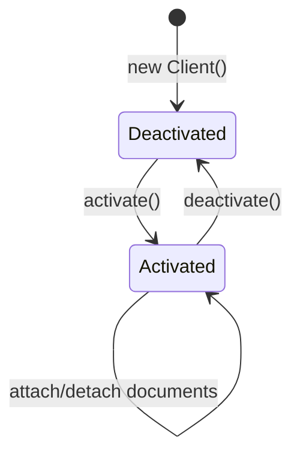
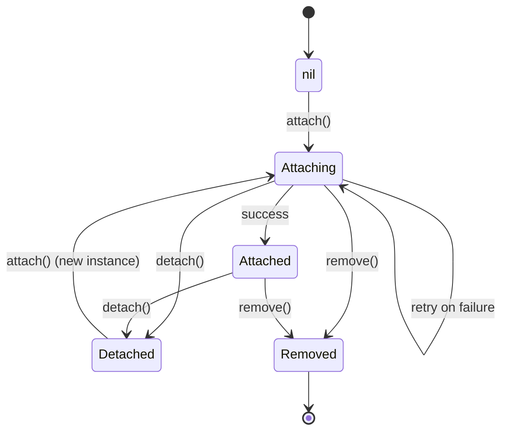

## Document Lifecycle

In Yorkie, documents and clients follow a well-defined lifecycle with distinct states and transitions. Understanding this lifecycle helps you design robust collaborative applications that handle all edge cases -- from initial connection through disconnection, reattachment, and deletion.

### Client Lifecycle

A [Client](/docs/js-sdk#client) must be activated before it can work with documents or channels.



| State | Description |
|-------|-------------|
| **Deactivated** | The client exists locally but has no connection to the server. No documents can be attached. |
| **Activated** | The client is registered with the server and can attach to documents and channels. |

When a client is deactivated (via `client.deactivate()` or by the server's [Housekeeping](/docs/glossary) process), all attached documents are detached and resources are released.

### Document States

A document transitions through several states during its lifecycle:



| State | Description | Allowed Operations |
|-------|-------------|-------------------|
| **nil** | No document exists yet for this client. | `attach()` |
| **Attaching** | The client is attempting to attach to a document. | `attach()` (retry), `detach()`, `remove()` |
| **Attached** | The document is successfully attached and synchronized. | `update()`, `subscribe()`, `detach()`, `remove()`, `PushPull` |
| **Detached** | The document has been detached but the client is still active. | `attach()` (with a new Document instance) |
| **Removed** | The document has been soft-deleted and can no longer be edited. | `deactivate()` |

### Attach and Detach

**Attaching** a document subscribes the client to it, enabling synchronization:

```javascript
const doc = new yorkie.Document('doc-1');
await client.attach(doc, {
  initialPresence: { cursor: { x: 0, y: 0 } },
});
// doc is now in "Attached" state
```

**Detaching** stops synchronization, closes the [Watch Stream](/docs/internals/synchronization#the-watch-stream), and releases resources:

```javascript
await client.detach(doc);
// doc is now in "Detached" state
```

### Reattaching a Document

After a document is detached, you can reattach to the same document key, but you **must create a new Document instance**:

```javascript
// Correct: create a new instance
const doc2 = new yorkie.Document('doc-1');
await client.attach(doc2);

// Incorrect: reusing the detached instance is NOT supported
// await client.attach(doc); // This will not work
```

This design ensures [Garbage Collection](/docs/internals/crdt-concepts#garbage-collection) consistency and prevents internal state conflicts. Detached documents are not included in GC calculations, so reattaching a stale instance could leave inconsistent tombstone nodes.

### Document Removal

Documents can be removed (soft-deleted) while in the `Attaching` or `Attached` state:

```javascript
await client.remove(doc);
// doc is now in "Removed" state -- no further edits possible
```

The removal process:

1. The client sends a `RemoveDocument` request to the server.
2. The server marks the document's `RemovedAt` field with the current time (soft delete).
3. All other clients are notified that the document is removed.
4. After a configured period, the [Housekeeping](/docs/glossary) process permanently deletes the document and its data (hard delete).

#### Key-ID Relationship

With document removal and recreation, the relationship between document keys and IDs is **1:N** -- multiple documents can share the same key (representing different versions created at different times). Documents are identified internally by their unique ID, not just their key.

### Document Status Events

Subscribe to document status changes to handle lifecycle transitions in your application:

```javascript
doc.subscribe('status', (event) => {
  if (event.value.status === DocStatus.Attached) {
    // Document is attached and ready for editing
  } else if (event.value.status === DocStatus.Detached) {
    // Document has been detached
  } else if (event.value.status === DocStatus.Removed) {
    // Document has been removed -- disable editing UI
  }
});
```

### Client Deactivation

When a client is deactivated, all of its documents transition according to their current state:

- **Attached** documents are implicitly detached
- **Removed** documents remain removed
- The client moves to the **Deactivated** state

The server's Housekeeping process automatically deactivates clients that have been inactive for longer than the `client-deactivate-threshold` (default: 24 hours). This is important for [Garbage Collection](/docs/internals/crdt-concepts#garbage-collection) -- inactive clients prevent the `minVersionVector` from advancing, blocking GC of tombstoned nodes. By deactivating stale clients, the system can reclaim memory more efficiently.

You can subscribe to connection events to detect when this happens:

```javascript
doc.subscribe('status', (event) => {
  if (event.value.status === DocStatus.Detached) {
    // Client may have been deactivated by the server
    // Re-activate and reattach if needed
  }
});
```

### PushPull Availability

The `PushPull` synchronization operation is **only available in the Attached state**. This is a key constraint -- you cannot synchronize changes for documents in any other state.

| State | PushPull Available? |
|-------|-------------------|
| nil | No |
| Attaching | No (PushPull runs as part of the attach process) |
| **Attached** | **Yes** |
| Detached | No |
| Removed | No |

### Best Practices

1. **Always check document status** before performing operations, especially after network reconnection.
2. **Subscribe to status events** to update your UI when documents are detached or removed by external events (server housekeeping, other clients).
3. **Create new Document instances** when reattaching -- never reuse a detached instance.
4. **Handle the Removed state** gracefully by disabling editing UI and informing the user.
5. **Use `client-deactivate-threshold`** appropriately for your use case. Shorter thresholds improve GC efficiency but may deactivate clients on slow or intermittent connections.

### Further Reading

- [Document-Client Lifecycle design document](https://github.com/yorkie-team/yorkie/blob/main/design/document-client-lifecycle.md) -- Full state machine with detailed transitions
- [Document Editing design document](https://github.com/yorkie-team/yorkie/blob/main/design/document-editing.md) -- How local and remote editing works internally
- [Housekeeping design document](https://github.com/yorkie-team/yorkie/blob/main/design/housekeeping.md) -- Client deactivation and document compaction
- [Synchronization](/docs/internals/synchronization) -- PushPullChanges, checkpoints, and sync modes
- [CRDT Concepts: Garbage Collection](/docs/internals/crdt-concepts#garbage-collection) -- How GC relates to client lifecycle
- [JS SDK: Document](/docs/js-sdk#document) -- SDK reference for document operations
- [Glossary](/docs/glossary) -- Definitions of all key terms
