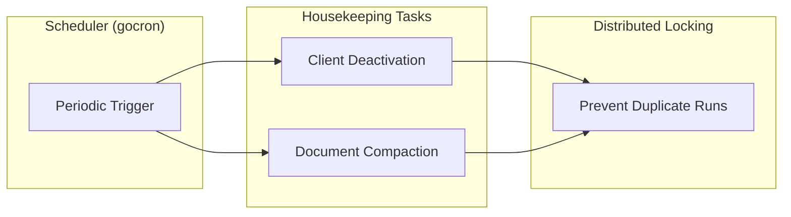
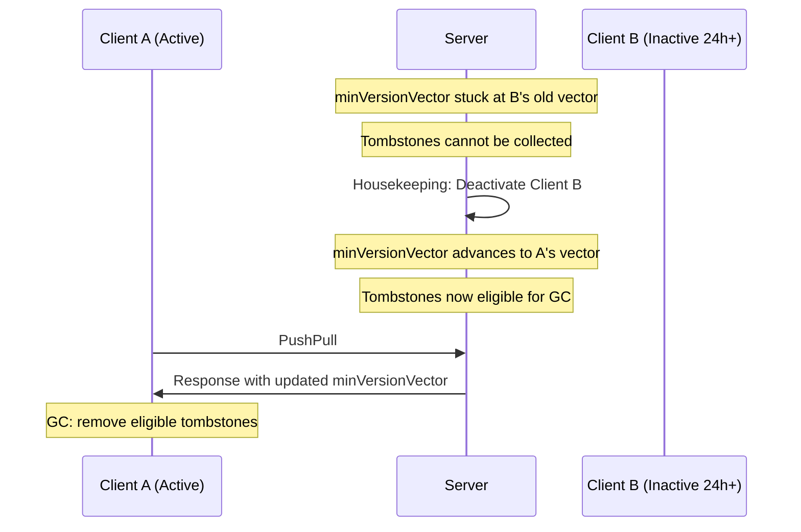

## Housekeeping

Housekeeping is a background service that periodically cleans up resources and data that are no longer needed in Yorkie. It plays a crucial role in maintaining performance and efficiency by managing memory usage and optimizing data storage in the CRDT-based collaborative system.

### Overview

As documents are edited over time, two types of overhead accumulate:

1. **Inactive clients** prevent [Garbage Collection](/docs/internals/crdt-concepts#garbage-collection) from reclaiming tombstoned nodes.
2. **Change history** grows continuously, increasing storage and memory costs.

Housekeeping addresses both by running two scheduled tasks:

| Task | Purpose |
|------|---------|
| **Client Deactivation** | Deactivates clients that have been inactive beyond a threshold, enabling more effective garbage collection |
| **[Document Compaction](/docs/internals/synchronization#document-compaction)** | Consolidates old change history into a single snapshot to reduce storage overhead |



### Client Deactivation for Garbage Collection

#### Why It Matters

In Yorkie's CRDT system, [Garbage Collection](/docs/internals/crdt-concepts#garbage-collection) uses the `minVersionVector` to determine which [tombstoned](/docs/internals/crdt-concepts#tombstones) nodes can be safely removed. The `minVersionVector` represents the minimum of all active clients' [version vectors](/docs/internals/crdt-concepts#version-vectors) -- the set of changes that every active client has definitely received.

If a client becomes inactive but remains registered, its outdated version vector holds back the `minVersionVector`, preventing garbage collection from reclaiming potentially large amounts of data.



#### How It Works

1. The scheduler triggers the deactivation task at the configured interval.
2. For each [Project](/docs/advanced/projects), the system queries for clients that have not communicated with the server for longer than the `client-deactivate-threshold` (default: 24 hours).
3. Each candidate client is deactivated, removing it from the active client set.
4. The `minVersionVector` can now advance, unblocking garbage collection.

Projects are processed in a round-robin fashion across runs, distributing load over time rather than processing all projects in a single cycle.

### Document Compaction

Over time, a document accumulates a large history of individual changes. Document Compaction reduces storage overhead by:

1. Removing old change history that is no longer needed for synchronization.
2. Creating a new initial change that represents the current document state.
3. Maintaining document integrity while reducing metadata size.

#### Compaction Criteria

A document is eligible for compaction when:

- It has accumulated at least `CompactionMinChanges` changes (default: 1000).
- It is **not** currently attached to any client.

The second condition ensures that compaction does not interfere with active editing sessions. Document content remains identical after compaction -- only the internal change history is consolidated.

### Configuration

Housekeeping behavior is configured through server startup flags or the [CLI](/docs/tools/cli). The key parameters are:

| Parameter | Description | Default |
|-----------|-------------|---------|
| `housekeeping-interval` | Time between housekeeping runs | `30s` |
| `housekeeping-candidates-limit-per-project` | Maximum candidates returned per project in a single run | `500` |
| `housekeeping-project-fetch-size` | Number of projects fetched per run | `100` |
| `housekeeping-compaction-min-changes` | Minimum number of changes before a document is eligible for compaction | `1000` |
| `client-deactivate-threshold` | Time after which an inactive client is deactivated | `24h` |

These can be set when starting the server:

```bash
$ yorkie server \
  --housekeeping-interval 30s \
  --housekeeping-candidates-limit-per-project 500 \
  --housekeeping-compaction-min-changes 1000 \
  --client-deactivate-threshold 24h
```

Or updated per project using the [CLI](/docs/tools/cli#updating-the-project):

```bash
$ yorkie project update <project-name> \
  --client-deactivate-threshold 12h
```

#### Configuration by Environment

For **development**, use shorter intervals and lower thresholds for faster feedback:

```bash
$ yorkie server \
  --housekeeping-interval 10s \
  --housekeeping-candidates-limit-per-project 10 \
  --housekeeping-compaction-min-changes 100
```

For **production**, use longer intervals and higher limits to balance throughput with resource usage:

```bash
$ yorkie server \
  --housekeeping-interval 1m \
  --housekeeping-candidates-limit-per-project 1000 \
  --housekeeping-compaction-min-changes 5000
```

### Cluster Mode Behavior

In a [Cluster Mode](/docs/internals/cluster-mode) deployment, only the leader server executes housekeeping tasks. This is coordinated through leader election, preventing duplicate work across cluster nodes.

For more on leader election, see [Cluster Mode: Architecture Components](/docs/internals/cluster-mode#architecture-components).

### Monitoring

Housekeeping logs its activity for observability:

```
HSKP: candidates 150, deactivated 45, 2.3s
HSKP: candidates 89, compacted 12, 1.8s
```

These logs show the number of candidates processed, the actions taken, and the duration of each run. Use these to tune configuration parameters for your workload.

### Further Reading

- [Housekeeping design document](https://github.com/yorkie-team/yorkie/blob/main/design/housekeeping.md) -- Full technical design
- [CRDT Concepts: Garbage Collection](/docs/internals/crdt-concepts#garbage-collection) -- How GC uses version vectors to reclaim tombstones
- [Synchronization: Document Compaction](/docs/internals/synchronization#document-compaction) -- How compaction fits into the sync lifecycle
- [Garbage Collection design document](https://github.com/yorkie-team/yorkie/blob/main/design/garbage-collection.md) -- Deep dive into the GC mechanism
- [Projects](/docs/advanced/projects) -- Per-project configuration including housekeeping thresholds
- [CLI: Updating the Project](/docs/tools/cli#updating-the-project) -- How to configure client deactivation threshold
- [Cluster Mode](/docs/internals/cluster-mode) -- Leader election and distributed coordination
- [Glossary](/docs/glossary) -- Definitions of all key terms
