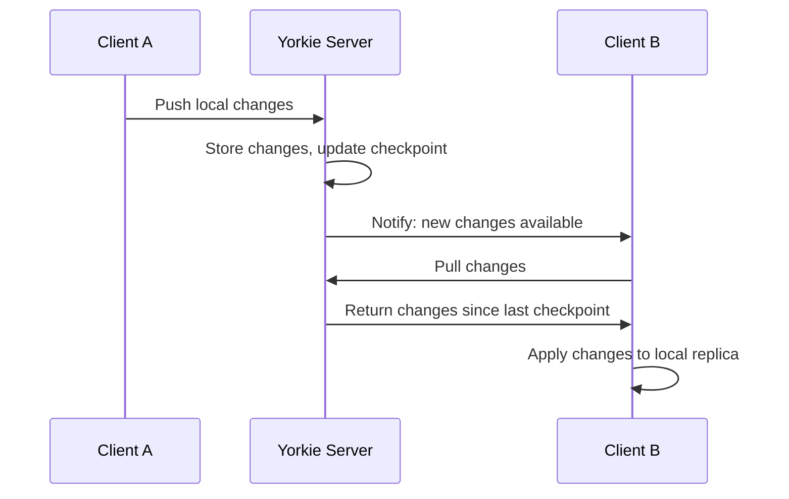
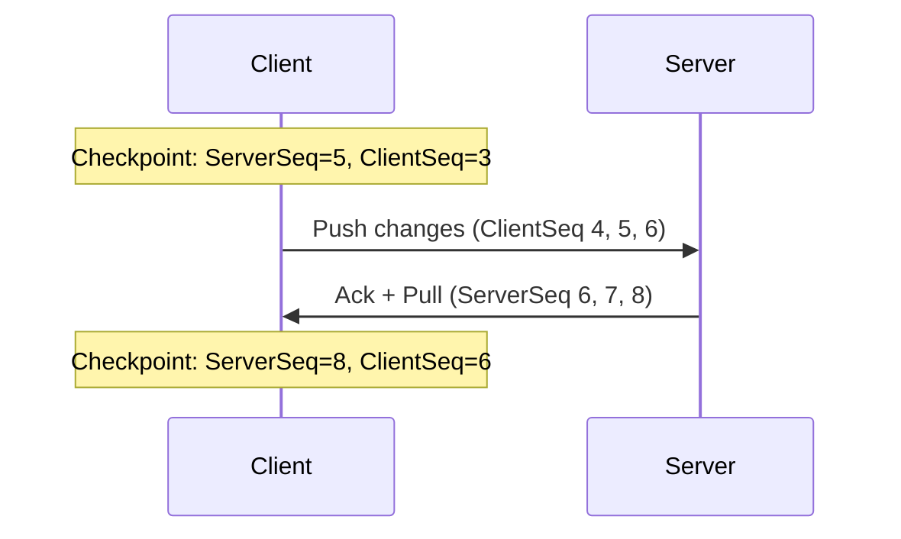
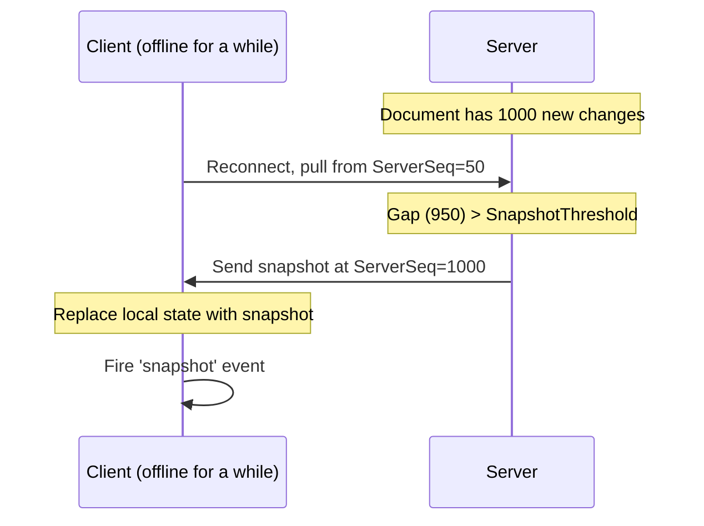
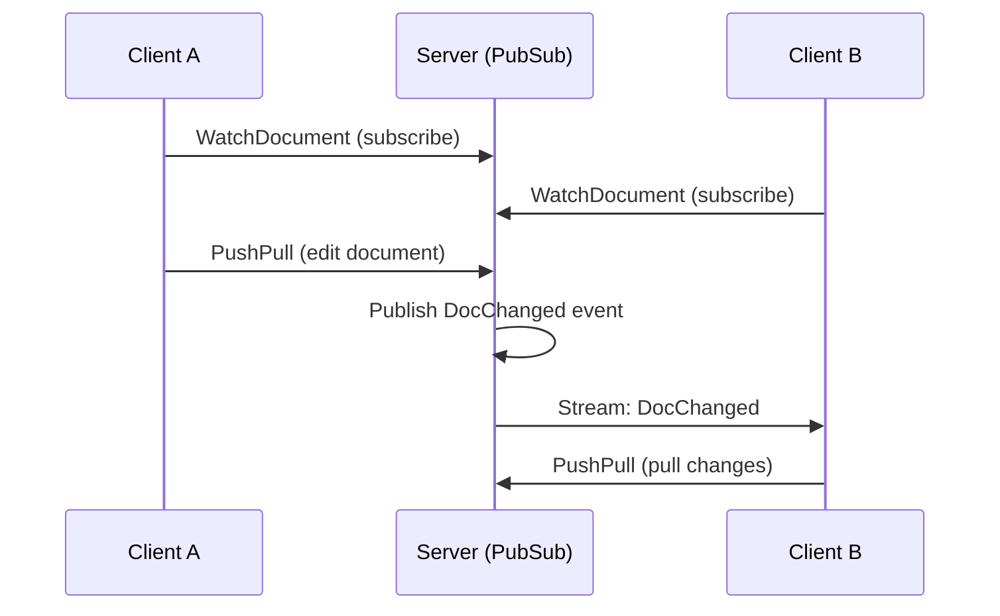

## Synchronization

Yorkie keeps document replicas consistent across multiple [Clients](/docs/js-sdk#client) through a synchronization system built on top of [CRDTs](/docs/internals/crdt-concepts). This page explains the mechanisms that make synchronization work: sync modes, PushPullChanges, checkpoints, snapshots, and the watch stream.

### Overview

When a [Client](/docs/js-sdk#client) is attached to a [Document](/docs/js-sdk#document), Yorkie maintains a bidirectional communication channel between the client and the [Server](/docs/self-hosted-server). Changes made locally are pushed to the server, and changes from other clients are pulled. The system tracks what each client has seen using [Checkpoints](#checkpoints) and uses [Snapshots](#snapshots) to optimize synchronization for clients that have fallen behind.



### How Editing Works Internally

Understanding how Yorkie handles edits internally helps explain the synchronization process. Each Document contains three internal components:

| Component | Role |
|-----------|------|
| **Root** | The source of truth -- the actual CRDT data of the document. It can only be updated by applying [Changes](/docs/js-sdk#editing-the-document). |
| **Clone** | A proxy copy of the Root. When you call `document.update()`, your edits are first applied to the Clone, which generates Changes. If the operation succeeds, the Changes are then applied to the Root. This provides transaction-like safety. |
| **LocalChanges** | A buffer that stores Changes waiting to be pushed to the server. Changes are applied locally first, then synchronized asynchronously. |

#### Local Editing Flow

When you call `document.update()`:

1. Your edits are applied to the **Clone** (proxy), which generates **Changes**.
2. The Changes are applied to the **Root** (source of truth).
3. The Changes are added to the **LocalChanges** buffer.
4. The Client detects pending changes and pushes them to the Server asynchronously.
5. The Server stores the changes and notifies other clients via the [Watch Stream](#the-watch-stream).

#### Remote Editing Flow

When another client's changes arrive:

1. The Client receives changes from the Server during a PushPull operation.
2. The Changes are applied to the local **Root** using CRDT merge rules.
3. Subscribed event handlers (via `document.subscribe()`) are called with the change events.

This local-first approach means your application remains responsive even with network latency. For the full technical details, see the [Document Editing design document](https://github.com/yorkie-team/yorkie/blob/main/design/document-editing.md).

### Sync Modes

Yorkie provides four synchronization modes that control how a document syncs with the server. You can change the mode at any time using `client.changeSyncMode()`.

| Mode | Push | Pull | Watch Stream | Use Case |
|------|------|------|-------------|----------|
| **`Realtime`** | Automatic | Automatic | Active | Default mode for real-time collaboration |
| **`RealtimePushOnly`** | Automatic | Disabled | Active | When you want to send changes but not receive others (e.g., a presenter mode) |
| **`RealtimeSyncOff`** | Disabled | Disabled | Active | Temporarily pause sync while staying aware of connection status |
| **`Manual`** | Manual only | Manual only | Disconnected | Full control over when sync happens; useful for batch operations |

```javascript
import { SyncMode } from '@yorkie-js/sdk';

// Start with real-time sync (default)
await client.attach(doc);

// Switch to push-only
await client.changeSyncMode(doc, SyncMode.RealtimePushOnly);

// Pause all sync
await client.changeSyncMode(doc, SyncMode.RealtimeSyncOff);

// Switch to manual mode
await client.changeSyncMode(doc, SyncMode.Manual);
await client.sync(doc); // Manually trigger sync
```

For the full SDK reference, see [Synchronization Modes](/docs/js-sdk#synchronization-modes).

### PushPullChanges

**PushPullChanges** is the core synchronization API that enables bidirectional exchange of [Changes](/docs/js-sdk#editing-the-document) between a client and the server. Each sync cycle involves:

1. **Push**: The client sends its local changes (operations made since the last sync) to the server.
2. **Server processing**: The server stores the changes, assigns them a server sequence number, and updates the client's [Checkpoint](#checkpoints).
3. **Pull**: The server returns any changes from other clients that this client hasn't seen yet.
4. **Local application**: The client applies the received changes to its local replica using CRDT merge rules.

In `Realtime` mode, PushPullChanges is triggered automatically whenever:
- The client makes a local change (push)
- The server notifies the client of remote changes via the watch stream (pull)

In `Manual` mode, you trigger it explicitly:

```javascript
// Manually synchronize changes
await client.sync(doc);
```

### Checkpoints

A **Checkpoint** tracks the synchronization state between a client and the server. It consists of two sequence numbers:

| Field | Description |
|-------|-------------|
| **ServerSeq** | The latest server sequence number that the client has received. This represents how far the client has caught up with the server's change history. |
| **ClientSeq** | The latest client sequence number that the server has acknowledged. This represents how many of the client's local changes the server has received. |

Checkpoints enable efficient synchronization by allowing the server to determine exactly which changes a client still needs:



Checkpoints are also used by [Garbage Collection](/docs/internals/crdt-concepts#garbage-collection) to determine when tombstoned nodes can be safely removed -- only after all clients have synced past the version where the node was deleted.

### Snapshots

A **Snapshot** is a complete representation of a document's state at a specific point in time. Snapshots optimize synchronization for clients that have fallen significantly behind.

#### When Are Snapshots Used?

Instead of sending a potentially large sequence of individual changes, the server sends a single snapshot when:

- The number of changes a client needs to catch up exceeds the **SnapshotThreshold** (configured per project)
- A client reconnects after being offline for an extended period
- The gap between the client's checkpoint and the current server state is too large

#### How Snapshots Work



#### Handling Snapshots in Your Application

When a snapshot event occurs, the document's entire state is replaced. Subscribe to the `snapshot` event to update your UI accordingly:

```javascript
doc.subscribe((event) => {
  if (event.type === 'snapshot') {
    // The entire document has been replaced with a snapshot.
    // Re-render the full document state from doc.getRoot().
  }
});
```

Snapshot format uses [YSON](/docs/internals/yson) for serialization, supporting all of Yorkie's custom CRDT types.

### The Watch Stream

In `Realtime` sync modes, Yorkie maintains a **watch stream** -- a persistent connection between the client and server, implemented using [gRPC server-side streaming](https://grpc.io/docs/languages/go/basics/#server-side-streaming-rpc).

#### How the Watch Stream Works

The watch stream uses a **PubSub pattern** on the server:

1. When a client calls `WatchDocument`, the server creates a **Subscription** for that client and adds it to a subscriptions map keyed by document.
2. When changes occur (via PushPull), the server publishes a `DocChanged` event.
3. The PubSub system delivers the event to all subscriptions watching that document.
4. Each subscription's event channel sends the event through the gRPC stream to the client.



#### Event Types

The watch stream delivers three types of events:

| Event | Description |
|-------|-------------|
| **DocChanged** | The document has been modified by another client. Triggers a pull operation. |
| **DocWatched** | A new client has started watching the document (came online). |
| **DocUnwatched** | A client has stopped watching the document (went offline or detached). |

These events power the [Presence](/docs/js-sdk#presence) system, enabling features like showing who's online and tracking cursor positions.

#### Connection Monitoring

You can monitor the watch stream status:

```javascript
doc.subscribe('connection', (event) => {
  if (event.value === StreamConnectionStatus.Connected) {
    // Watch stream is connected
  } else if (event.value === StreamConnectionStatus.Disconnected) {
    // Watch stream is disconnected; sync paused
  }
});
```

When the watch stream disconnects, local changes are buffered and pushed once the connection is restored. This is how Yorkie supports offline editing.

For the full PubSub design, see the [PubSub design document](https://github.com/yorkie-team/yorkie/blob/main/design/pub-sub.md).

### Document Compaction

Over time, a document accumulates a large history of individual changes. **Document Compaction** is a server-side process that reduces storage overhead by:

1. Removing old change history that is no longer needed for synchronization.
2. Creating a new initial change that represents the current document state.
3. Maintaining document integrity while reducing metadata size.

Compaction is performed by the [Housekeeping](/docs/glossary) background service and only runs on documents that:
- Have at least a configured minimum number of changes (default: 1000)
- Are not currently attached to any client

This process is transparent to clients -- they continue to operate normally while compaction runs on the server.

### Synchronization Lifecycle

Here's the complete lifecycle of a document from attachment to detachment. For the full state machine, see [Document Lifecycle](/docs/internals/document-lifecycle).

1. **Attach**: Client calls `client.attach(doc)`. The document is synced from the server and a watch stream is established.
2. **Edit**: Client makes changes via `doc.update()`. Changes are first applied locally (Root/Clone), then automatically pushed in `Realtime` mode.
3. **Receive**: Remote changes arrive via the watch stream (`DocChanged` event) and are pulled and merged into the local replica.
4. **Mode changes**: Application can switch sync modes as needed (e.g., pausing sync during bulk operations).
5. **Detach**: Client calls `client.detach(doc)`. Final changes are pushed, the watch stream is closed, and resources are released.

### Further Reading

- [Document Lifecycle](/docs/internals/document-lifecycle) -- State transitions of documents and clients
- [Document Editing design document](https://github.com/yorkie-team/yorkie/blob/main/design/document-editing.md) -- Root/Clone/LocalChanges architecture
- [PubSub design document](https://github.com/yorkie-team/yorkie/blob/main/design/pub-sub.md) -- Watch stream implementation
- [Housekeeping design document](https://github.com/yorkie-team/yorkie/blob/main/design/housekeeping.md) -- Background compaction and cleanup
- [JS SDK: Synchronization Modes](/docs/js-sdk#synchronization-modes) -- SDK reference for sync mode APIs
- [JS SDK: Subscribing to Changes](/docs/js-sdk#subscribing-to-changes) -- How to react to local, remote, and snapshot events
- [CRDT Concepts](/docs/internals/crdt-concepts) -- How CRDTs ensure conflict-free merging
- [Revisions](/docs/advanced/revisions) -- Saving and restoring document snapshots
- [Glossary](/docs/glossary) -- Definitions of all key terms
