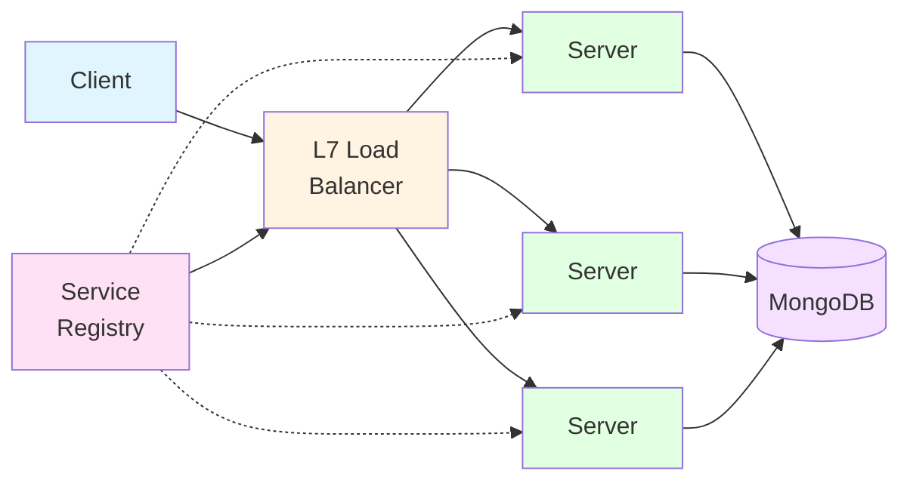

## Self-Hosted Server

This page explains how to run your own Yorkie Server.

To run a Yorkie Server, you need to install the CLI. If you haven't installed it yet, please refer to [CLI](/docs/tools/cli).

### Running a Server via CLI

Start a Server with the following command:

```bash
$ yorkie server

backend created: id: cppoq5huevgut6tjo8qg, db: memory
serving RPC on 8080
serving profiling on 8081
```
The Server handles administrative requests such as project maintenance and continues to run until it receives termination commands such as Ctrl+C.
The Server stores its data using an in-memory database, which does not provide durability by default.

### Persistence

If you start the Server with a MongoDB address, you can permanently save the data stored by Yorkie.

> To start MongoDB, `docker-compose -f build/docker/docker-compose.yml up --build -d` in [the project root](https://github.com/yorkie-team/yorkie).

Then, start a Yorkie Server with `--mongo-connection-uri` flag to connect the MongoDB.

```bash
$ yorkie server --mongo-connection-uri mongodb://localhost:27017

MongoDB connected, URI: mongodb://localhost:27017, DB: yorkie-meta
backend created: id: cppoqe9uevguvlsehcg0, rpc: mongodb://localhost:27017
serving profiling on 8081
serving RPC on 8080
```

### Monitoring

The Server exports metrics under the `/metrics` path on its profiling port. Fetch the metrics with curl:

```bash
$ curl http://localhost:8081/metrics

yorkie_server_version{server_version="{{site.version}}"} 1
# HELP yorkie_pushpull_received_changes_total The total count of changes included
# TYPE yorkie_pushpull_received_changes_total counter
yorkie_pushpull_received_changes_total 6
...
```

These metrics can be collected by [Prometheus](https://prometheus.io/).

Running [Prometheus](https://prometheus.io/) and [Grafana](https://grafana.com/oss/grafana/) is the easiest way to monitor the Server's metrics.

First, download all manifest files from the [docker folder](https://github.com/yorkie-team/yorkie/tree/main/build/docker). Then start the applications with `docker-compose`:

```bash
$ docker-compose -f docker-compose-full.yml up --build -d

Creating prometheus ... done
Creating grafana    ... done
```

Now, Prometheus will collect Server metrics every 10 seconds.

Grafana has built-in Prometheus support. Add a Prometheus data source:

```
Name:   prometheus
Type:   Prometheus
Url:    http://localhost:9090
Access: proxy
```

Then, import the [default Yorkie dashboard template](https://grafana.com/grafana/dashboards/18560-yorkie-dashboard/) and customize it. For instance, if Prometheus data source name is `my-prometheus`, the datasource field values in JSON also need to be `my-prometheus`.

Sample dashboard:

<Image alt="dashboard" src="/assets/images/docs/dashboard.png" width={600} height={626} style={{ maxWidth: '600px' }} />

### Sharded Cluster

In a production environment, a server cluster is necessary to handle large workloads while ensuring high availability, reliability, and scalability.

Yorkie provides a sharded cluster in Kubernetes environments to support production environments.

This section describes how to set up a sharded cluster. An example of the sharded cluster architecture:



- L7 Load Balancer: It is responsible for routing requests to servers based on the computed request’s hash key and consistent hashing algorithm.
- Service Registry: It is responsible for storing metadata and configuration settings for Yorkie servers.
- MongoDB: It stores the data of Yorkie. It can be configured to use sharding, just like Yorkie sharded cluster.

Yorkie provides a Helm Chart, a package manager for Kubernetes, to easily deploy a Yorkie cluster on Kubernetes with the above components configured.

Below are guides for deploying Yorkie cluster on Kubernetes with Helm Charts on various platforms.

- [Minikube Installation](/docs/self-hosted-server/minikube): Guide to install Yorkie cluster on Minikube.
- [AWS EKS Installation](/docs/self-hosted-server/aws-eks): Guide to install Yorkie cluster on AWS EKS.

Also, you can additionally deploy Yorkie cluster addons on Kubernetes with Helm Charts on your own environment.

Yorkie cluster addons include:

- Monitoring: Provides Yorkie metrics and logging via Grafana dashboard.
- GitOps: Provides Yorkie Continuous Delivery via ArgoCD.

Below is guide for deploying Yorkie cluster addons on Kubernetes with Helm Charts.

- [Cluster Addons Installation](/docs/self-hosted-server/cluster-addons): Guide to install Yorkie cluster addons on Kubernetes.
